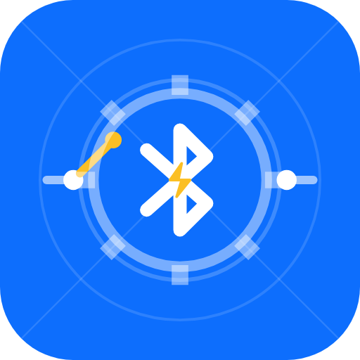

# Bluetooth Relay Automator

<p align="center">
  
</p>

[](LICENSE)
[](https://developer.android.com)
[](https://kotlinlang.org)
[](https://developer.android.com/jetpack/compose)

A powerful, modern Android application for controlling, configuring, and automating **Bluetooth Low Energy (BLE) relay switches**. Built natively using **Jetpack Compose**, **Material 3**, and **Kotlin Coroutines**.

Designed for garage doors, gates, garden watering pumps, light automation, and IoT projects — working 100% offline with zero cloud dependency.

---

## Features

- **Macro Automation Engine**:
  - Chain multi-step sequences: `CONNECT`, `ON`, `OFF`, `DELAY`, `DISCONNECT`, `SEND_HEX`, and `SEND_TEXT`.
  - Automatic connection recovery and target device MAC resolution.
  - Safe execution with background scan suspension during active macro runs.
  - Comprehensive execution logs with step timings and error tracking.

- **Real-Time Bluetooth Status**:
  - Live proximity status indicator on each macro card using the standard Bluetooth icon:
    - **Solid Blue**: Target relay is currently connected and ready.
    - **Pulsing Blue**: Target relay is detected within radio range and can be connected.
    - **Grey (Disabled)**: Target relay is disconnected and out of range (Run button is safely disabled).
  - Interactive status explanation dialog on tap.
  - Fast background scanning (2-second interval) for instant proximity updates.

- **Interactive BLE Terminal**:
  - Real-time logging of bidirectional BLE traffic with timestamped HEX and ASCII inspection (`TX`, `RX`, `INFO`, `ERROR`).
  - Quick action buttons: **ON**, **OFF**, **Pulse 500ms (Toggle)**, and **Clear**.
  - Send custom HEX commands (e.g. `A0 01 01 A2`) or ASCII text strings (e.g. `AT+...`).

- **Homescreen App Widgets**:
  - **Standard Widget (2x1)**: One-tap execution with macro title, status text, and icon feedback.
  - **Compact Widget (1x1)**: Minimalist one-tap trigger for rapid homescreen switching.
  - Distinct haptic vibration feedback for successful and failed executions.
  - Background `ForegroundService` ensuring reliable execution even when the app is closed.

- **Device Management**:
  - Discover BLE relays with continuous or timed scanning.
  - Displays device names, MAC addresses, and real-time RSSI signal strength.
  - Pair and save relays with custom aliases (e.g., *"Garage Door"*, *"Garden Pump"*).

- **Modern UI & Localization**:
  - Clean Material 3 design with dark mode and dynamic color support.
  - Multi-language support: English (default) and German (automatically matches device system language).

---

## Supported Hardware & BLE Modules

The app is compatible with standard Bluetooth Low Energy relay modules and serial BLE bridges, including:

| Hardware / Chipset | Service UUID | Write Characteristic | Default ON/OFF Command |
|-------------------|--------------|----------------------|------------------------|
| **DollaTek BLE Relay** | `0000ffe0-...` | `0000ffe1-...` | `A0 01 01 A2` / `A0 01 00 A1` |
| **LC Technology 1/2/4 Channel** | `0000ffe0-...` | `0000ffe1-...` | `A0 01 01 A2` / `A0 01 00 A1` |
| **HM-10 / CC2540 / CC2541** | `0000ffe0-...` | `0000ffe1-...` | Configurable HEX/Text |
| **Nordic UART Service (NUS)** | `6e400001-...` | `6e400002-...` | Configurable HEX/Text |
| **JDY Series (JDY-08 / JDY-30 / JDY-31)** | `0000ffe0-...` | `0000ffe1-...` | Configurable HEX/Text |
| **Universal Fallback** | Any BLE Service | First writable characteristic | Custom HEX / Text |

### ⚠️ BLE Exclusivity (No Classic Bluetooth SPP)

> **Important**: This app communicates **strictly via Bluetooth Low Energy (BLE / Bluetooth 4.0+)** GATT services.
>
> - **Supported**: BLE relay modules (e.g. DollaTek, LC Technology, HM-10, CC2541, JDY-08, Nordic UART Service / NUS devices).
> - **NOT Supported**: Classic Bluetooth SPP (Serial Port Profile, RFCOMM, e.g. legacy **HC-05** or **HC-06** Bluetooth modules).
>
> **Why BLE only?**
> - **Instant Connection**: BLE GATT connections can be established programmatically without tedious OS-level pairing dialogues or PIN entries.
> - **High-Frequency Proximity Sensing**: Fast, low-energy background scanning allows the app to update relay proximity statuses in real-time (solid blue, pulsing blue, disabled) without draining the device battery.
> - **Background Reliability**: Seamless automation execution via Android Foreground Services and Homescreen Widgets.

---

## Architecture & Code Structure

```
com.neckarhackerapps.bluetoothrelayautomator
├── MainActivity.kt               # Main Jetpack Compose entry point
├── RelayAutomatorApp.kt         # Application class, Dependency Injection & Notification Channels
├── ble/                          # Bluetooth Low Energy engine
│   ├── BleConnectionState.kt     # BLE connection state definitions
│   ├── BleGattConstants.kt       # Known service/characteristic UUIDs & command byte helpers
│   ├── BleRelayManager.kt        # GATT connection, characteristic discovery, and packet transmission
│   └── BleScanner.kt             # High-speed BLE scanner with RSSI and proximity cache
├── engine/                       # Automation engine
│   ├── MacroExecutionState.kt    # State representation for executing macros
│   └── MacroExecutor.kt          # Sequential macro executor with timeout, logging, and retry logic
├── model/                        # Data models
│   ├── ExecutionLog.kt           # History record for macro executions
│   ├── Macro.kt                  # Macro definition with step list and device reference
│   ├── MacroBleStatus.kt         # Proximity state (CONNECTED, IN_RANGE, NOT_IN_RANGE)
│   ├── MacroStep.kt              # Command step (ON, OFF, DELAY, CONNECT, DISCONNECT, etc.)
│   ├── RelayDevice.kt            # BLE device with MAC, name, alias, and RSSI
│   └── TerminalEntry.kt          # Terminal event (TX, RX, INFO, ERROR)
├── repository/                   # Local persistence layer (SharedPreferences & JSON)
│   ├── ExecutionLogRepository.kt # Execution history repository
│   ├── MacroRepository.kt        # Saved macros and default seed macros
│   └── RelayRepository.kt        # Saved paired relays
├── service/                      # Background services
│   └── RelayMacroForegroundService.kt # Foreground service for widgets with haptics
├── ui/                           # Jetpack Compose UI
│   ├── MainAppScreen.kt          # Navigation bar (Macros, Devices, Terminal, History)
│   ├── components/               # Reusable UI widgets (ConnectionStatusBar)
│   └── screens/                  # Feature screens
│       ├── DevicesScreen.kt      # BLE scanner and paired devices list
│       ├── LogsScreen.kt         # Execution history and error details
│       ├── MacroEditorDialog.kt  # Step-by-step macro editor and step tester
│       ├── MacrosScreen.kt       # Macros dashboard with real-time BLE status indicators
│       └── TerminalScreen.kt     # Live BLE terminal and direct command transmitter
└── widget/                       # Homescreen App Widgets
    ├── RelayMacroWidgetProvider.kt         # Standard 2x1 interactive widget
    ├── RelayMacroCompactWidgetProvider.kt  # Compact 1x1 interactive widget
    ├── RelayMacroWidgetConfigureActivity.kt# Widget configuration activity
    └── WidgetConfigManager.kt              # Widget configuration persistence
```

---

## Getting Started

### Prerequisites
- **Android Studio** Hedgehog (2023.1.1) or newer
- **JDK 17** (or configured Android Studio embedded JDK)
- **Android SDK Platform 35** (Minimum SDK: 26 / Android 8.0 Oreo)
- Physical Android device with Bluetooth Low Energy (BLE) support

### Building and Testing

1. **Clone the repository**:
   ```bash
   git clone https://github.com/derntl/bt-relais-automator.git
   cd bt-relais-automator
   ```

2. **Run Unit Tests**:
   ```bash
   ./gradlew testDebugUnitTest
   ```

3. **Build Debug APK**:
   ```bash
   ./gradlew assembleDebug
   ```
   Output APK: `app/build/outputs/apk/debug/app-debug.apk`

4. **Build Release APK**:
   Place your signing credentials in `keystore.properties` (or use the configured release keystore):
   ```bash
   ./gradlew assembleRelease
   ```
   Output APK: `app/build/outputs/apk/release/app-release.apk`

---

## Permissions

The app requests only the minimum required permissions to communicate with BLE hardware:
- `BLUETOOTH` & `BLUETOOTH_ADMIN` (Android 11 and lower)
- `ACCESS_FINE_LOCATION` (Required for BLE scanning on Android 11 and lower)
- `BLUETOOTH_SCAN` (`neverForLocation` enabled on Android 12+)
- `BLUETOOTH_CONNECT` (Android 12+)
- `POST_NOTIFICATIONS` (Android 13+ for foreground widget service notifications)
- `VIBRATE` (Haptic pulse feedback on widget tap)

No internet permission is declared — the app never connects to external servers or tracks user data.

---

## License

This project is licensed under the **MIT License** — see the [LICENSE](LICENSE) file for details.
